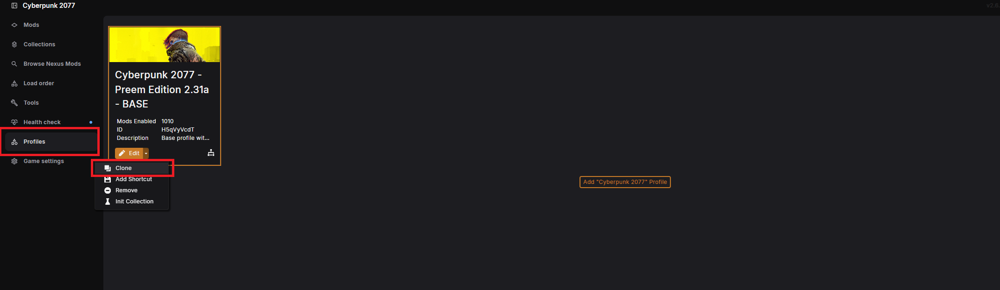
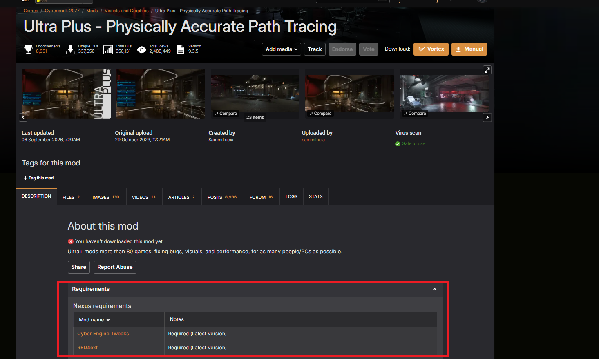

# PERSONAL MODS // ADDING TO PREEM EDITION

> `> INITIATING SETUP SEQUENCE...`
> `> TARGET: MANUAL MOD INSTALLATION`

Want to add your own personal mods on top of Preem Edition? No problem —
just do it right, choom. This guide walks you through safely adding mods
that aren't part of the collection, without risking your main setup.

"Cool ain't free. Neither's a build that doesn't break the second you touch it." <cite>— Rogue Amendiares</cite>

!!! danger "Read this before you touch anything"
    Always work off a cloned profile, never your main one. If something
    breaks, you want a safe fallback to switch straight back to.

!!! tip "Credit"
    This guide was written by **mquiny**, thank you for putting it together!
    
## Before you start

- [ ] I know which mod(s) I want to add
- [ ] I've cloned my Preem Edition profile so my main one stays untouched

## Step-by-step

Tick a step off once you've finished it — your progress is saved in this
browser, so it's still here if you close the tab and come back later.

  <input type="checkbox" class="pt-steps-progress-check" data-pt-progress-check disabled aria-hidden="true">
  

    0 / 5 steps complete
    

  

<input type="checkbox" class="pt-step-check" data-pt-step-check aria-label="Mark Step 1 complete">
Step 1: Create a cloned profile

Create a cloned profile in Vortex. This ensures you can safely make
changes on top of the Preem Edition collection, and have a safe, working
fallback profile if something messes up.

??? example "📷 Show me"
    { width="500" }

!!! tip
    To help keep track of your profiles, rename them to something you'll
    remember, so it's easy to tell which one is your safe fallback. For
    example:

    - `Preem Edition — Base Collection`
    - `Preem Edition — Additional Mods`

- [ ] Cloned profile created and renamed

<input type="checkbox" class="pt-step-check" data-pt-step-check aria-label="Mark Step 2 complete">
Step 2: Check the mod page

With your selected mod, check its Nexus page for any additional
dependencies it needs.

For example: installing
[Ultra Plus](https://www.nexusmods.com/cyberpunk2077/mods/2500), its
"Requirements" section lists **Cyber Engine Tweaks** and **RED4ext** —
these are core frameworks already included in the collection, so nothing
extra to do there. But if a dependency listed *isn't* already in the
collection, you'll need to install that too, or the mod won't work.

??? example "📷 Show me"
    { width="500" }

!!! danger
    Have a quick read of the mod description for any conflicts the mod
    author has flagged. If it conflicts with something already in the
    collection (e.g. a mod like Third Person Perspective), you'll need to
    decide which one to keep — unless you set up a conflict rule to have
    them work together.

- [ ] Checked the mod's requirements and any flagged conflicts

<input type="checkbox" class="pt-step-check" data-pt-step-check aria-label="Mark Step 3 complete">
Step 3: Check the game runs

Now that your first manual mod is installed, boot up the game and check
that it's detected and working, with no crashes.

!!! warning
    If you start experiencing issues, you've got a couple of options:

    - Remove the mod you just installed
    - Check out [How to Bisect](../troubleshooting/how_to_bisect.md) to
      identify which mod it could be conflicting with

- [ ] Game boots and the new mod is working correctly

<input type="checkbox" class="pt-step-check" data-pt-step-check aria-label="Mark Step 4 complete">
Step 4: Repeat for every mod you want to add

Now that your first mod is installed, repeat from Step 2 to add more.

!!! tip
    If you're confident the mods you're adding won't conflict with
    anything in the collection, feel free to install them without
    constantly re-checking that the game still boots after each one.

- [ ] Added all the personal mods I wanted, one at a time

<input type="checkbox" class="pt-step-check" data-pt-step-check aria-label="Mark Step 5 complete">
Step 5: Enjoy your new experience

!!! success "Well done, choom"
    You've successfully installed additional mods on top of Preem Edition
    — enjoy your Preem Edition... Deluxe Edition.

"Every job's got a right way and a fast way. Only one of them doesn't come back to bite you." — Preem Team install notes

