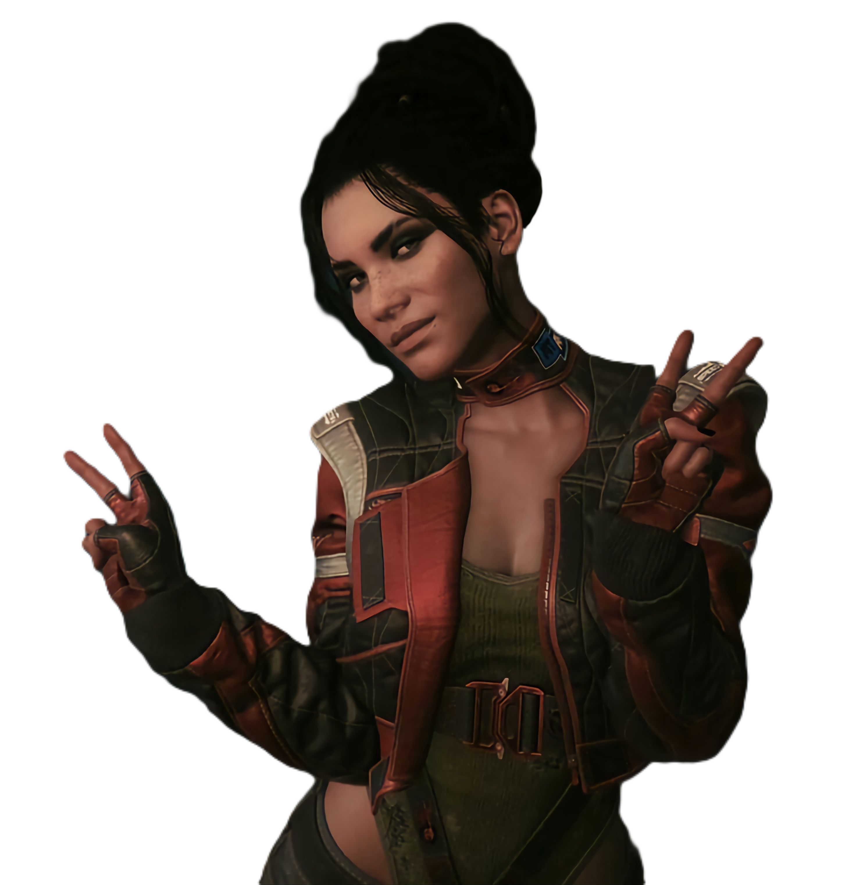
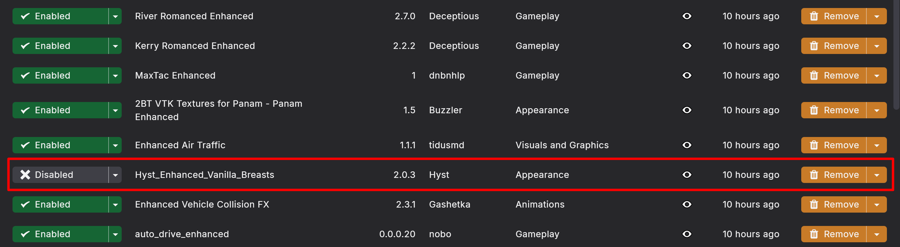
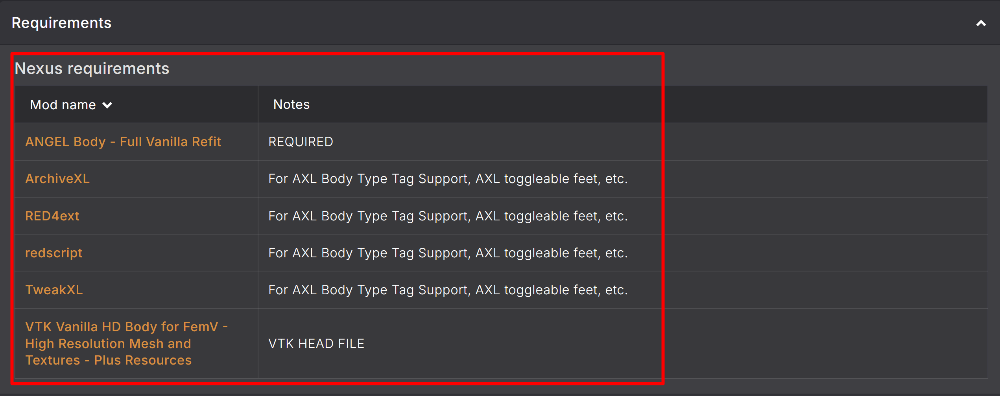
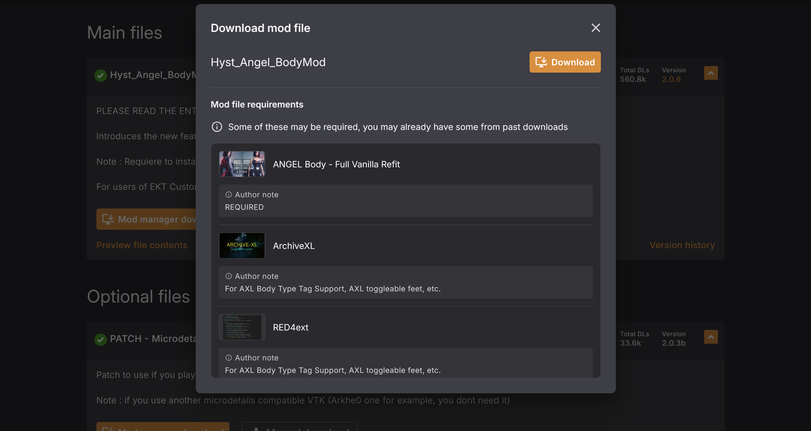

# CHANGING YOUR BODY MOD // RE-JACKING THE CHASSIS

> `> INITIATING SETUP SEQUENCE...`
> `> TARGET: FEM V BODY MOD SWAP`

Want to change Fem V's body? No problem. Preem Edition is built to let you
customize your game, including swapping out the body mod your character
uses.

This guide uses **ANGEL Body** as the example, but the same general process
applies when switching to any other body mod.

"Changing your ride, doesn't mean you change who's driving." <cite>— Panam Palmer</cite>

!!! danger "Read this before you touch anything"
    Body mods can have their own requirements and clothing refits. Always
    read the requirements and compatibility information on the body mod's
    own Nexus page before installing it.

!!! tip "Credit"
    This guide was written by **Cara**, thank you for putting it together!

## Before you start

- [ ] I know which body mod I'm switching to
- [ ] I've checked that mod's Nexus page for its own requirements and clothing refits

!!! info "What's the difference between a body mod and a body rig?"
    - A body mod replaces V's actual body mesh and/or skin textures with a
      new one — it changes what the body geometrically *is*, which is why
      vanilla clothes can need refitting to fit it properly. (Most body
      mods have separate refit mods to go with them.)
    - A body rig keeps the vanilla body mesh but reshapes it by adjusting
      the underlying skeleton/bone weights (proportions like bust, waist,
      hips), so it's more like a set of sliders on the existing body. Since
      it's still the same mesh clothes were built for, clothing
      compatibility is generally much less of an issue.

## Step-by-step

Tick a step off once you've finished it, your progress is saved in this
browser, so it's still here if you close the tab and come back later.

  <input type="checkbox" class="pt-steps-progress-check" data-pt-progress-check disabled aria-hidden="true">
  

    0 / 6 steps complete
    

  

<input type="checkbox" class="pt-step-check" data-pt-step-check aria-label="Mark Step 1 complete">
Step 1: Disable mods connected to your current body

Before installing a new body, disable the mods that are specifically tied to
your **current** body mod. This can include:

- Body-specific clothing refits (in this collection, the clothing that's
  added uses automatic refits, so you don't have to disable any clothing
  mods)
- Body-specific appearance mods
- Body-specific vanilla clothing refits (again, automatic refits in this
  collection mean you don't need to disable clothing mods)
- Other mods that directly replace or modify the current body (e.g.
  Enhanced Vanilla Body, or Tasty Body Rig if you want a different rig)

??? example "📷 Show me"
    { width="500" }
    { width="500" }

!!! info "What about Unique V Framework?"
    Unique V makes it so that only V's body is affected by the body mod you
    install. Without it, every NPC using the same body type as V will use
    your chosen body mod too.

    - If your new body mod **does not** support Unique V, disable Unique V.
    - If it **does** support Unique V, you can leave it enabled.

!!! note
    You don't need to disable every clothing mod in Preem Edition, only
    disable mods that are specifically dependent on, or designed around,
    your **old** body. This matters because refits made for another body can
    conflict with your new one. The ANGEL vanilla refit, for example,
    specifically recommends removing vanilla refit replacers intended for
    other body mods ([Nexus Mods](https://www.nexusmods.com/cyberpunk2077/mods/15151)).

- [ ] Disabled any mods tied specifically to my old body

<input type="checkbox" class="pt-step-check" data-pt-step-check aria-label="Mark Step 2 complete">
Step 2: Check your new body mod's requirements

Go to your new body mod's Nexus page and check its **Requirements** section.
Different body mods can require different frameworks, so don't assume every
body uses the same ones.

??? example "📷 Show me"
    { width="500" }

For ANGEL's vanilla clothing refit, the required core frameworks are:

- RED4ext
- ArchiveXL
- TweakXL
- redscript

The refit also requires the ANGEL body itself
([Nexus Mods](https://www.nexusmods.com/cyberpunk2077/mods/15151)).

!!! tip
    Some of these requirements may already be installed as part of Preem
    Edition, you don't need to install another copy if the required
    framework is already present and up to date.

- [ ] Checked my new body mod's requirements on Nexus

<input type="checkbox" class="pt-step-check" data-pt-step-check aria-label="Mark Step 3 complete">
Step 3: Download any missing requirements

Download anything listed as a requirement that isn't already installed in
your Preem Edition setup, and install it **before** installing the body mod
itself. If you're using Vortex, you can install these normally through
Vortex, just make sure they're enabled and deployed afterward.

- [ ] Installed any missing requirements and confirmed they're enabled/deployed

<input type="checkbox" class="pt-step-check" data-pt-step-check aria-label="Mark Step 4 complete">
Step 4: Download the new body mod

Now download your new body mod (ANGEL Body, in this example) from its Nexus
page, install it through Vortex, and enable it. At this point you've
replaced your previous body.

??? example "📷 Show me"
    { width="500" }

!!! warning "Don't install every available body variant"
    If the body mod offers different versions or options, read the mod
    description and choose the version you actually want. Only install the
    options you need.

- [ ] Downloaded and enabled the new body mod

<input type="checkbox" class="pt-step-check" data-pt-step-check aria-label="Mark Step 5 complete">
Step 5: Check in-game

Make sure all the mods for your new body are activated and deployed. If
Vortex didn't deploy automatically after installation, hit **Deploy Mods**
again.

??? example "📷 Show me"
    { width="500" }
    { width="500" }

Now launch Cyberpunk 2077 and check your V. Make sure:

- [ ] V's body is appearing correctly
- [ ] There are no obvious missing body parts
- [ ] The game loads normally
- [ ] Your character isn't still using the previous body

!!! success "Looking good?"
    If everything checks out, your new body is installed and working.

<input type="checkbox" class="pt-step-check" data-pt-step-check aria-label="Mark Step 6 complete">
Step 6: Have fun and find some new clothes

Now comes the fun part. Once you've confirmed your new body works, you can
start looking for clothing mods and refits made for it.

When downloading clothing, always check which body it was made for, look
for "ANGEL Body compatible" (or the equivalent for whichever body you
installed), or a body-specific refit. A clothing mod made for another body
may not fit correctly and can cause clipping or other visual problems.

There are also dedicated refits for vanilla and DLC clothing, for example,
ANGEL Body - Full Vanilla Refit was made specifically to adapt vanilla and
DLC clothing to ANGEL Body
([Nexus Mods](https://www.nexusmods.com/cyberpunk2077/mods/15151)).

- [ ] Found clothing/refits compatible with my new body

!!! success "That's it"
    You do not need to reinstall Preem Edition from scratch just to change
    your body. The important part is making sure your body, body-specific
    refits, and clothing are all compatible with each other.

## TLDR

Changing your body in Preem Edition is basically:

1. Disable mods connected to your current body
2. Check the new body's requirements
3. Download any missing requirements
4. Install the new body
5. Launch the game and check that it works
6. Find some clothing made for your new body

"New chassis, same choom underneath." — Preem Team install notes

