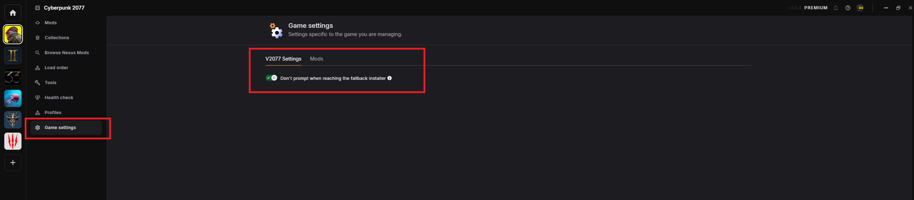
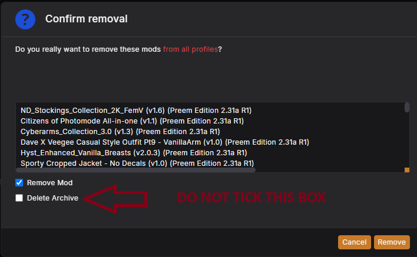
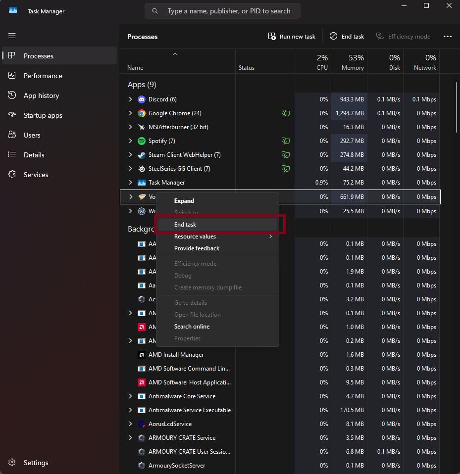
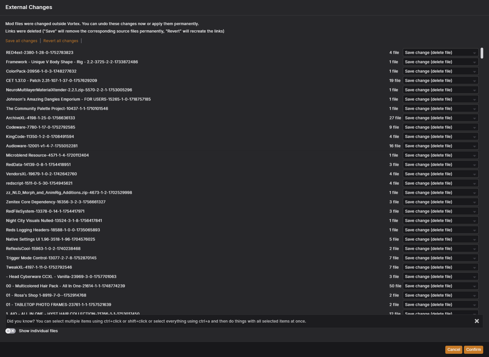
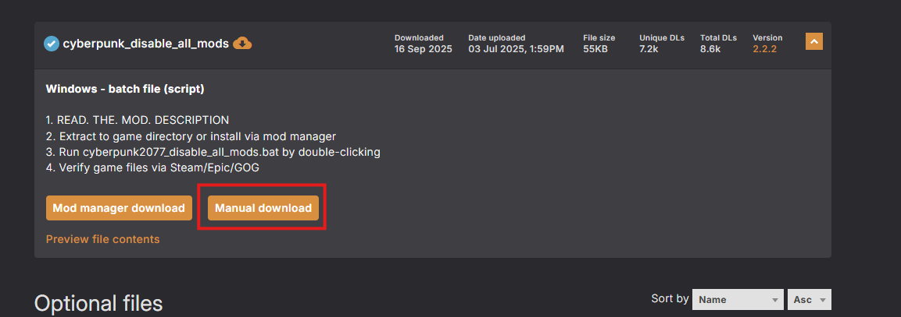
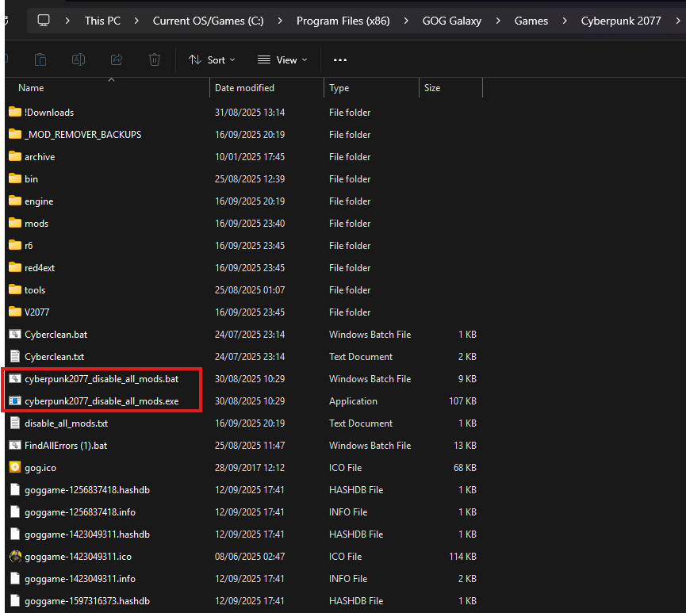
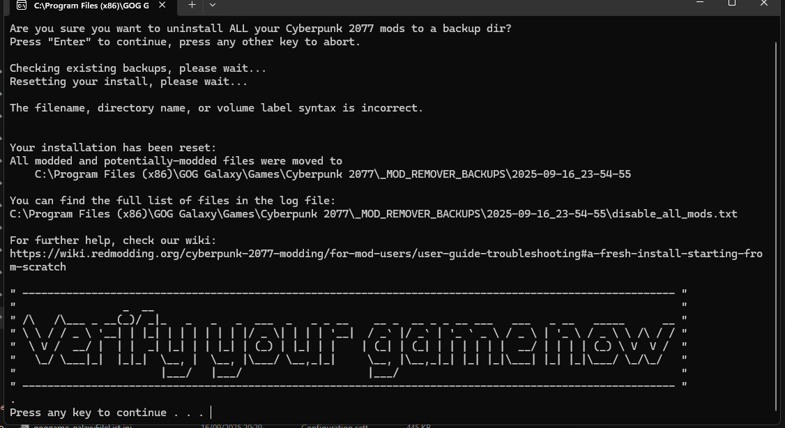
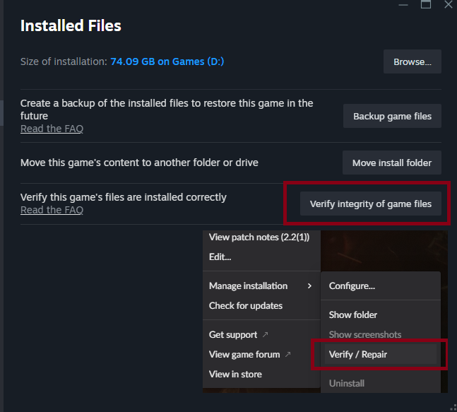

# CLEAN INSTALL // ROLLING BACK TO STOCK

> `> INITIATING ROLLBACK SEQUENCE...`
> `> TARGET STATE: PRE-MODDED / VANILLA`

This guide walks you through quickly resetting your modded Cyberpunk 2077
install back to a clean, vanilla state using the **Mod Remover** tool —
useful for diagnosing crashes, redscript errors, or conflicts, and for
double-checking whether an issue is caused by the collection or by the game
itself.

!!! info "Who this is for"
    Anyone who hit an install problem they can't shake, wants to update the
    game before the collection supports the new patch, or just wants to
    uninstall everything and start fresh.

## Before you start

- [ ] I've backed up any save files I want to keep (a clean install doesn't
  touch saves, but it's good practice before touching game files)
- [ ] I've noted which personal mods I have installed outside the collection —
  they'll show as "uninstalled" in Vortex afterward and need re-adding by hand

!!! tip
    If you only want to remove *one* mod rather than the whole collection,
    check [Common Problems](../troubleshooting/common_problems.md) first —
    a full clean install is the last resort, not the first troubleshooting
    step.

## Step-by-step removal

Tick a step off once you've finished it — your progress is saved in this
browser, so it's still here if you close the tab and come back later.

  <input type="checkbox" class="pt-steps-progress-check" data-pt-progress-check disabled aria-hidden="true">
  

    0 / 7 steps complete
    

  

<input type="checkbox" class="pt-step-check" data-pt-step-check aria-label="Mark Step 1 complete">
Step 1: Double check V2077 settings

Before getting started, double check you have the correct V2077 settings
inside of Vortex.

Make sure **"Don't prompt when reaching fallback installer"** is **ON**.

- [ ] Confirmed "Don't prompt when reaching fallback installer" is ON

??? example "📷 Show me"
    { width="500" }

<input type="checkbox" class="pt-step-check" data-pt-step-check aria-label="Mark Step 2 complete">
Step 2: Remove all mods

1. Open up Vortex, and under **Mods** select all the mods (`Ctrl+A`).
2. At the bottom of Vortex select **Remove**, then check **Remove mod** from
   the popup menu — **don't select "Delete Archive"**.

*If `Ctrl+A` doesn't work: select the top mod, scroll to the bottom, hold
`Ctrl` and select the last mod — this will highlight them all.*

This will remove mods linked to Vortex and leave Vortex clean. You may have
to do this multiple times if you still see mods in Vortex — these will
likely be older versions left over from previous revisions.

!!! note "Personal mods"
    For any personal mods you have installed, make a note of which ones you
    have, as you'll have to re-install them once you've re-added the
    collection (they'll appear as "uninstalled" in Vortex).

- [ ] All mods removed from Vortex (repeated if any leftovers remained)

??? example "📷 Show me"
    { width="500" }

!!! danger "Read before Step 3"
    Once you've removed all mods in Vortex, you **must** force close Vortex.
    Vortex **must not** be open or running while you run Mod Remover, or
    this will throw errors later down the line.

    **Vortex must be closed/not running once this step is complete.**

    ??? example "📷 Show me"
        { width="500" }

!!! failure "Getting an error message about external changes?"
    You didn't force close Vortex properly before running Mod Remover.
    Revert the changes it's warning you about, close Vortex fully this
    time, and run Mod Remover again.

    ??? example "📷 Show me"
        { width="500" }

<input type="checkbox" class="pt-step-check" data-pt-step-check aria-label="Mark Step 3 complete">
Step 3: Download Mod Remover

Head over to Nexus and download [Mod Remover](https://www.nexusmods.com/cyberpunk2077/mods/8597).

- [ ] Downloaded Mod Remover

??? example "📷 Show me"
    { width="500" }

<input type="checkbox" class="pt-step-check" data-pt-step-check aria-label="Mark Step 4 complete">
Step 4: Stick Mod Remover in root

Extract the contents of Mod Remover into your game's root directory, and run
either the `.exe` or `.bat`.

- [ ] Mod Remover extracted into the game's root directory

??? example "📷 Show me"
    { width="500" }

<input type="checkbox" class="pt-step-check" data-pt-step-check aria-label="Mark Step 5 complete">
Step 5: Run the program

Now run the program — you'll be prompted to press Enter to create a backup.
It will then begin removing all modded files from your directory, leaving a
clean install.

Once it's done, you'll see a screen showing the locations of the backups (in
case you need to re-add them later), and a prompt to verify your game files.

- [ ] Ran Mod Remover and let it finish

??? example "📷 Show me"
    { width="500" }

<input type="checkbox" class="pt-step-check" data-pt-step-check aria-label="Mark Step 6 complete">
Step 6: Verify game files

Once the program is done and asks you to verify game files, go into
Steam/GOG and verify/repair your game files.

- [ ] Platform verification completed with no unresolved errors

??? example "📷 Show me"
    { width="500" }

<input type="checkbox" class="pt-step-check" data-pt-step-check aria-label="Mark Step 7 complete">
Step 7: Done — some final checks

Congratulations, you should now have a clean Cyberpunk installation.

!!! danger "Do not open Vortex yet"
    First confirm your game boots in a vanilla state, using your default
    launcher (Steam/GOG) — not Vortex.

Once you've confirmed it boots vanilla, re-add the collection from our Nexus
page back into Vortex **under a new profile** (don't reuse your old
profile). This should fix most issues you may experience, from mods
installed incorrectly to auto convert accidentally being on during install.

- [ ] Game boots vanilla via Steam/GOG
- [ ] Collection re-added under a new Vortex profile

!!! success "You're back to stock"
    That's it — you're on a clean, vanilla install. From here you can update
    the game safely, or head back to [Installation](../installation/index.md)
    whenever you're ready to mod it again.

!!! failure "Still seeing mod content or errors after this?"
    Something didn't get removed, or Vortex wasn't fully closed during Step
    2. Double-check that step, then re-run Mod Remover. If it persists, ask
    in the **Preem Team Discord** or check [Troubleshooting](../troubleshooting/index.md).

"Sometimes the cleanest jack-out is the one that leaves nothing behind." — Preem Team install notes

