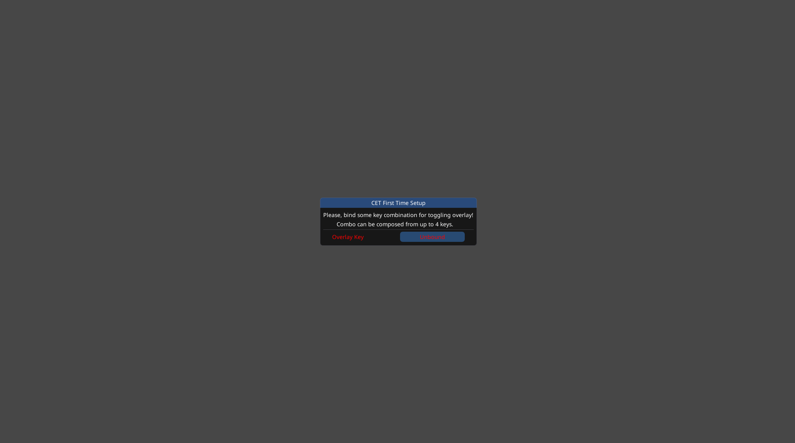
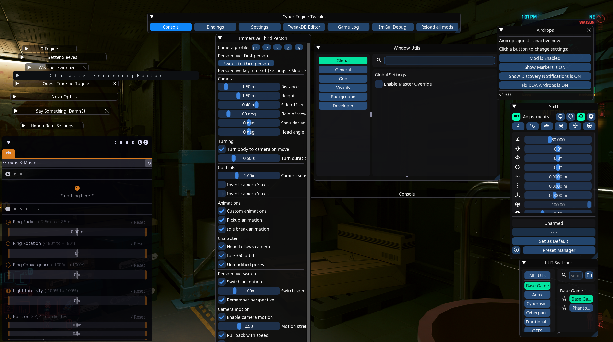
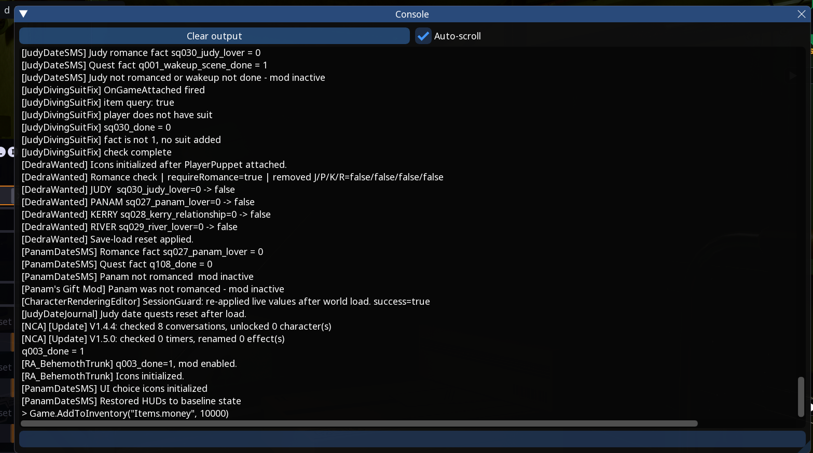
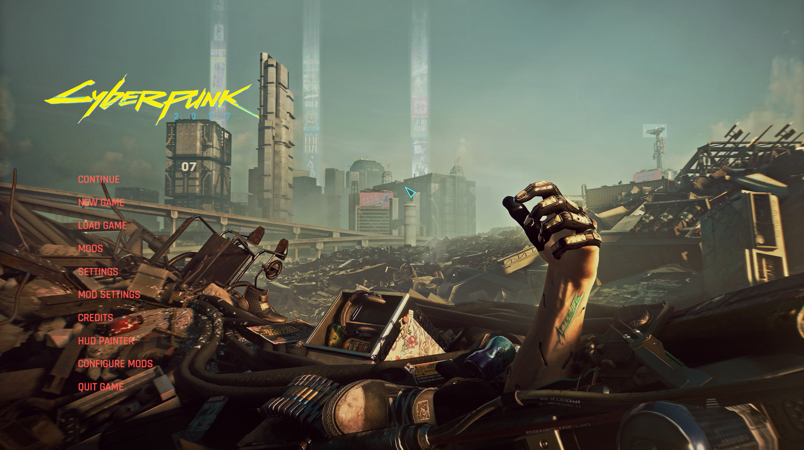
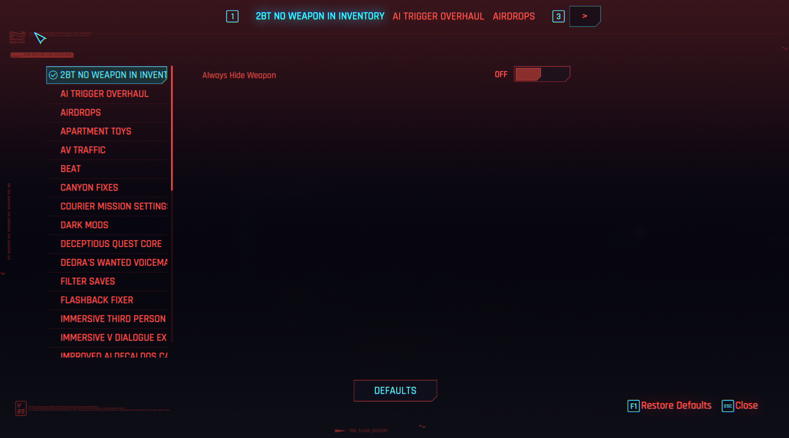
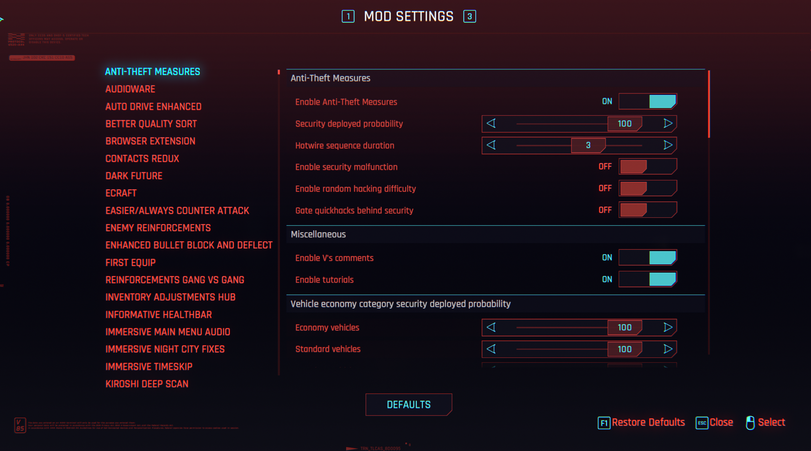
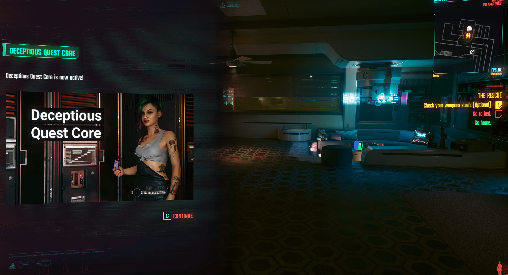
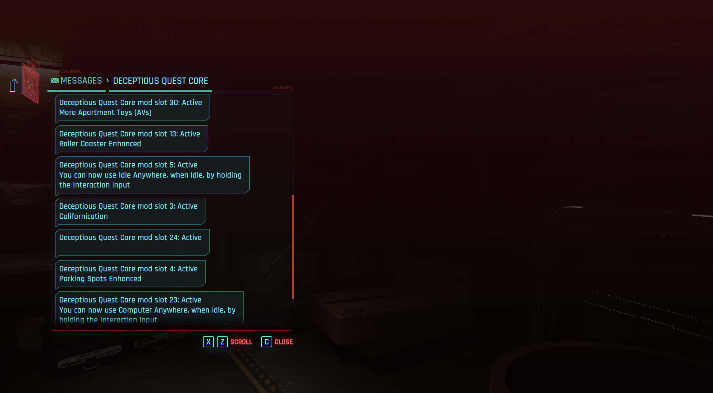
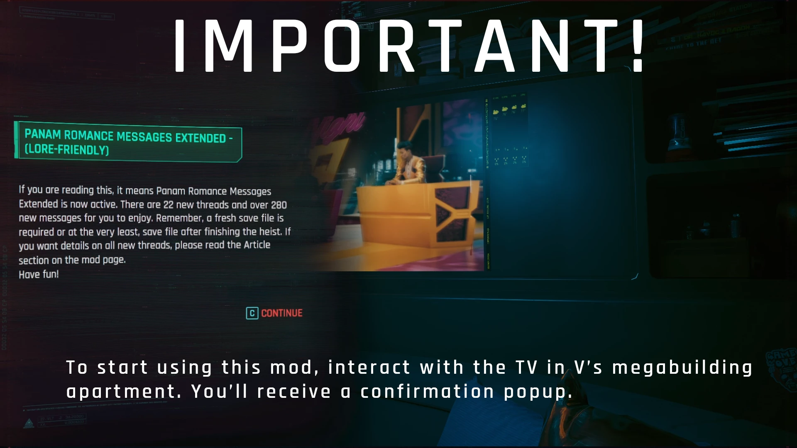

# First Time Boot // What do I do now?

> `> loading directory....`
> `> what do i do now chief?`

<div class="pt-mascot" markdown="1">

</div>

Hey, choom. It's Judy, so I see you've got yourself a Preem collection, let me walk you through what you should expect when you first load up this raw BD.

<p class="pt-judy-quote">"A raw BD, whaddya think, ever taken a dip before?" <cite>— Judy Alvarez</cite></p>

!!! info "What this guide is for"
    For anyone wondering how to check mods work, or just general things to check and configure, this is the place

## Before you start

!!! tip
    Below are a list of things you will need to do to activate some of the mods in this collection.

<div class="pt-steps" markdown="1" data-pt-steps>

<details class="pt-step" markdown="1" data-pt-step="1" id="set_cet_binds">
<summary>
<span class="pt-step-label">
<span class="pt-step-title">Set CET Keybinds</span>
</span>
</summary>
- If all mods are installed properly and the collection is finished when you first boot the game up it will ask you to set a CET (Cyber Engine Tweaks) keybind, set this to whatever key you want to open the menu.

- Disclaimer - Have you forgotten what keybind you set to open the CET (Cyber Engine Tweaks) menu.

- If you have never set any keybinds in the CET menu, go to the directory below and delete bindings.json

- If you have previously set keybinds and don't want to lose them, open up bindings.json in the directory below, search for "overlay_key", and set the value after the : to 0"

??? example "📷 Show me"
    { width="500" }

</details>

<details class="pt-step" markdown="1" data-pt-step="2" id="open_cet_menu">
<summary>
<span class="pt-step-label">
<span class="pt-step-title">Open the CET Menu</span>
</span>
</summary>
- Once you have set your keybind open up the CET (Cyber Engine Tweaks) menu with your set bind and the screen that pops up will have additional mods you can tweak.

!!! info
    Many mods will not be editable until you load a save up, so if you want access to change all the settings in CET menu load a save file and then open it up

??? example "📷 Show me"
    { width="500" }
	
</details>

<details class="pt-step" markdown="1" data-pt-step="3" id="using_cet_menu">
<summary>
<span class="pt-step-label">
<span class="pt-step-title">Using the CET Console</span>
</span>
</summary>
- A useful feature of the CET mod is the console bundled with it, here you can enter commands found from the internet and paste them here. Examples of which are money codes/item codes/spawn commands/location commands etc.

!!! info "Example commands"
    Click the copy icon in the top-right of any block below to copy that command.

    Gives 10,000 eurodollars:

    ```lua
    Game.AddToInventory("Items.money", 10000)
    ```

    Get in-game co-ords:

    ```lua
    print(Game.GetPlayer():GetWorldPosition())
    ```

    Sets character level to 60:

    ```lua
    Game.SetLevel("Level", 60, 1)
    ```
	
??? example "📷 Show me"
    { width="500" }
	
</details>

<details class="pt-step" markdown="1" data-pt-step="4" id="check_mod_menus">
<summary>
<span class="pt-step-label">
<span class="pt-step-title">Check Mod/Mod Settings Menu</span>
</span>
</summary>	

- These menus will come with toggles/settings for a wide variety of mods in the collection, not every mod will show here so you can typically expect to find around 20-30 mods listed that can be configured. Others might have config files to change (check mod page), or require specific mod versions that will need swapping out.

??? example "📷 Show me"
    { width="500" }
	
??? example "📷 Show me"
    { width="500" }
	
??? example "📷 Show me"
    { width="500" }
	
</details>

<details class="pt-step" markdown="1" data-pt-step="5" id="vs_apartment">
<summary>
<span class="pt-step-label">
<span class="pt-step-title">Enter Vs Apartment</span>
</span>
</summary>	

- Entering Vs apartment will be a trigger for many mods (mainly deceptious core), simply enter Vs apartment and a popup and a few text messages will come up with confirmation.

??? example "📷 Show me"
    { width="500" }
	
??? example "📷 Show me"
    { width="500" }	

</details>

<details class="pt-step" markdown="1" data-pt-step="6" id="interact_apartment_tv">
<summary>
<span class="pt-step-label">
<span class="pt-step-title">Interact with Vs TV</span>
</span>
</summary>
- Interacting with Vs TV whilst your at their apartment will also trigger mod activation. You will get a pop-up confirming this. 

!!! info
    - This might not trigger if no mods are activated this way, so if you do switch on the TV and nothing appears this is normal. As no mods that require TV activation are present

??? example "📷 Show me"
    { width="500" }	
	
</details>