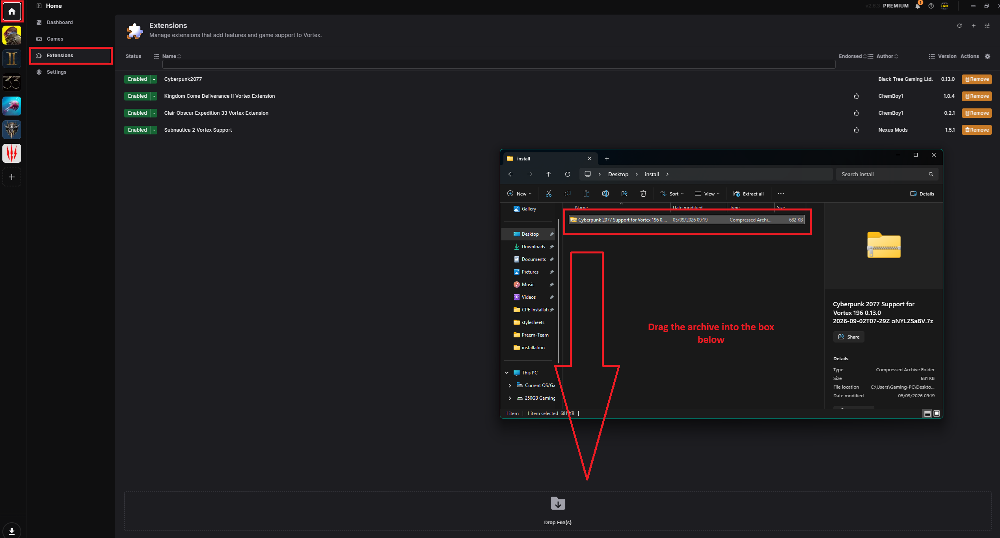
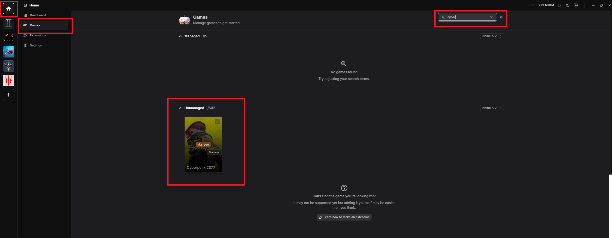
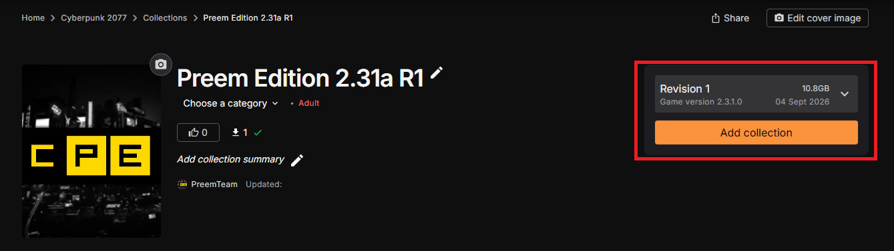
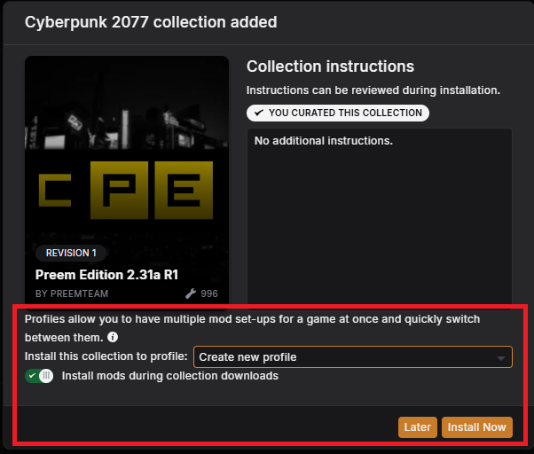
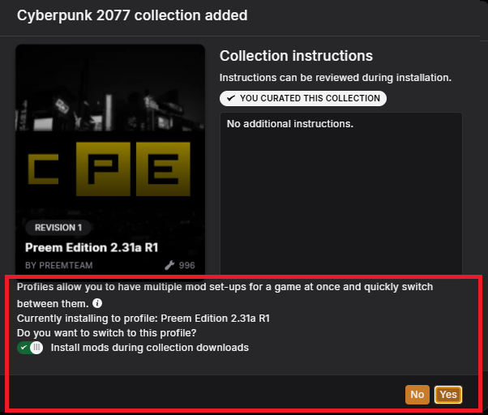

# INSTALLATION // JACKING IN

> `> INITIATING SETUP SEQUENCE...`
> `> ESTIMATED TIME: 5–10 MINUTES NEXUS PREMIUM`
> `> ESTIMATED TIME: 30-60 MINUTES NEXUS FREE USER`
> `> RISK LEVEL: LOW, IF YOU FOLLOW THE STEPS`

This page walks you through installing the full Preem Team collection, start
to finish. Follow it top to bottom — don't skip steps, don't improvise, and
you'll have a stable, modded Night City by the end of it.

!!! danger "Read this before you touch anything"
    Modding Cyberpunk 2077 touches your game files directly, but do so safely
    through Vortex. If you skip an installation step and something goes
    wrong, you may need to perform a [Clean Install](../guides/clean_install.md)
    to revert your game installation back to a pre-modded state.

## Overview checklist

Use this as your master checklist. Each item is explained in detail below.

- [ ] Verify my game version matches the collection's supported version
- [ ] Installing and Preparing Vortex
- [ ] Vortex - Select collection
- [ ] Vortex - Install Collection
- [ ] Verify installation

## Step-by-step installation

Tick a step off once you've finished it — your progress is saved in this
browser, so it's still here if you close the tab and come back later.

  <input type="checkbox" class="pt-steps-progress-check" data-pt-progress-check disabled aria-hidden="true">
  

    0 / 5 steps complete
    

  

<input type="checkbox" class="pt-step-check" data-pt-step-check aria-label="Mark Step 1 complete">
Step 1: Verify game version

1. Verify you have the most recent Cyberpunk Game Version, inside of your launcher Steam/GOG/Epic Games make sure Cyberpunk 2077 has no game updates available

!!! note "Which version do I need?"
    The collection is built against a specific Cyberpunk 2077 patch version.
    Check the [Changelog](../changelog/index.md) for the "Supported Game
    Version" note at the top of the latest entry before downloading.

!!! tip
    If you're not sure which version you're on, launch Cyberpunk 2077, go to
    the main menu, and check the version number in the bottom-right corner.

<input type="checkbox" class="pt-step-check" data-pt-step-check aria-label="Mark Step 2 complete">
Step 2: Installing and Preparing Vortex

1. **Grab the latest version of Vortex.**
      - If you haven't done so already, grab the latest version of [Vortex Mod Manager](https://www.nexusmods.com/vortex)
      - Make sure you are also on the latest Cyberpunk2077 Vortex extension [Here](https://www.nexusmods.com/site/mods/196?tab=files) - Make sure to select "Manual Download" and simply drag the .zip file into the extensions tab in Vortex

        ??? example "📷 Show me"
            { width="500" }

2. **Manage Game in Vortex.**
      - Next you want to go to the 'Home' tab in vortex, select 'Games' and search for Cyberpunk, then select 'Manage', to allow vortex to edit your game install.

        ??? example "📷 Show me"
            { width="500" }

3. **Configure Vortex Settings.**
      - Now we are going to configure some of the vortex settings

      **V2077 Settings**

      - Inside of V2077 Settings you want to make sure 'Don't prompt when reaching the fallback installer' is ticked (enabled).

        ??? example "📷 Show me"
            { width="500" }

      **Staging Folder**

      - For the "Mod Staging Folder" click on the little folder to the left of "Suggest" to choose where you want the staging folder to be

        ??? example "📷 Show me"
            { width="500" }

!!! danger "IMPORTANT!"
    - Make sure your selected staging folder is on the SAME drive as your game installation 
	- So if your game is installed on your C: drive, make sure your staging folder is also on your C: drive. (If you don't you won't get the "Hardlink Deployment" option which is required for mods to stage properly.) 
	- BUT - Make sure your staging folder is NOT inside of your Cyberpunk installation. Install it to a seperate part of the same drive.

<input type="checkbox" class="pt-step-check" data-pt-step-check aria-label="Mark Step 3 complete">
Step 3: Vortex - Select collection

Now it's time to select the collection to be downloaded/installed
**before** applying the collection itself.

=== "Vortex (recommended)"

    1. Open up vortex
    2. Under the "Browse Nexus Mods" tab in vortex, type in 'Preem Edition'
    3. This will bring up our collection, where you can select "Add Collection" to begin the install process

=== "Through Nexus Mods"

    1. Visit our Nexus Mods Collection page [here](https://www.nexusmods.com/games/cyberpunk2077/collections/usushu)
    2. Make sure the latest revision is selected (Top most option)
    3. Click "Add Collection" to begin the install process

    !!! info "Select latest revision!"
        Whenever you download the collection from nexus mods, always select the latest revision. Otherwise you might run the risk of incompatible/outdated mods being installed.

    ??? example "📷 Show me"
        { width="500" }

<input type="checkbox" class="pt-step-check" data-pt-step-check aria-label="Mark Step 4 complete">
Step 4: Vortex - Install Collection

1. **Confirm Installation.**

    1. A new popup will now appear asking how you want the collection installing. It will also include some instruction notes you can refer to.
    2. Make sure "Install this collection to profile:" is set to "Create new profile (Recommended by curator)"
    3. Make sure "Install mods during collection downloads" is ON (Green)
    4. For the final option at the time of writing this is a new setting and will need further testing. However at present make sure this setting is OFF (Gray), until we determine for definite what this is best to set as.
    5. Once done. click "Install now"
    6. Another popup might also appear asking if you wish to switch to the new profile. Select "Yes"

    ??? example "📷 Show me"
        { width="500" }
    ??? example "📷 Show me"
        { width="500" }	
!!! tip
    - Grab a coffee (or a synth-brew, if you're feeling thematic).
    - **Free Users** - You will get a popup prompt that will require you to go to each mod page on nexus, and manually select to install the mod to vortex. This will happen for every mod within the collection (Likely over 900 mods), so it will be very click intensive.
	- **Premium Users** - This is essentially one-click and wait, sit back, watch a video, grab a coffee until the collection is installed.
	- **Trial Nexus Premium** - As of the time of writing Nexus might have a free 3 day trial you can use, this will be region and eligibility dependant. If you live in a country not eligible for the trial, or your account has had premium before you might not be able to get it. However if you can, we highly recommend you use the trial period to download this collection to save time. And you can even use the trial to install collections for any other game you might have that's worth modding. Win win (Just make sure to cancel before the 3 days to avoid getting charged)

<input type="checkbox" class="pt-step-check" data-pt-step-check aria-label="Mark Step 5 complete">
Step 5: Verify installation

1. Launch Cyberpunk 2077 through Vortex's 'Play' button ( **not** Steam/GOG/Epic launcher unless instructed otherwise).
2. Watch the initial loading screen — you should see the **Cyber Engine Tweaks** console flash briefly, confirming CET loaded. (First time users may be prompted to set a keybind. Make sure it's a key you will remember)
3. Once in the main menu, press your CET hotkey (default: `` ` `` or `~`) to open the console overlay and confirm the mod list is populated.
4. Confirm you have 'mods' and 'mods settings' options in the main menu to confirm mods are installed.
!!! success "You're in"
    If every box above is checked, congratulations, choom — you're running
    the full Preem Team collection. Welcome to a better Night City.

!!! failure "Something's wrong?"
    Don't panic. Head straight to [Troubleshooting](../troubleshooting/index.md)
    — most first-install issues are covered in
    [Common Problems](../troubleshooting/common_problems.md).

"First rule of netrunning: always know your exit. Second rule: always back up your save." — Preem Team install notes

