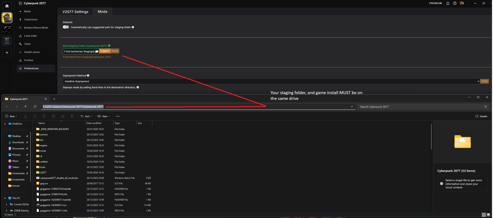
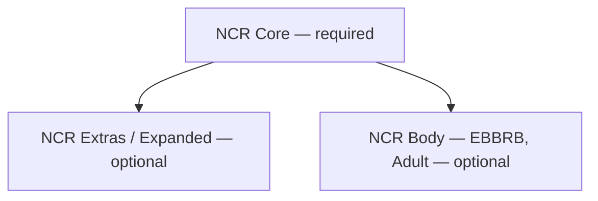

# INSTALLING NCR // VORTEX COLLECTION SETUP

> `> IMPORTING GUIDE FROM #how-to-install...`
> `> SOURCE: NCReborn`

This guide walks through installing the **NCR** collections using Vortex —
covering the required Vortex settings, staging folder setup, and which of
the three NCR collections you need.

!!! danger "Before starting"
    **NCR Core** must be installed for **NCR Extras** and **NCR Body** to
    work. You cannot run NCR Extras or NCR Body independently — Core is a
    hard dependency for both.

## Step 1: Add Cyberpunk to Vortex

This guide assumes **Vortex 2.0+**. If you haven't updated yet, grab the
latest version first:

[:material-download: Download Vortex](https://www.nexusmods.com/vortex){ .md-button }

1. Open Vortex and select the **"+"** tab on the sidebar.
2. Type in `Cyberpunk`.
3. In the middle of the Cyberpunk icon, a **Manage** button will appear.
4. Select it to let Vortex manage your game directory.

- [ ] Vortex is updated to 2.0 or later
- [ ] Cyberpunk 2077 shows up as a managed game in Vortex

---

## Step 2: Vortex Preferences — V2077 Settings

Next, open **Preferences** within your Cyberpunk tab in Vortex, and go to
the **V2077 Settings** section.

| Setting | Required value |
|---|---|
| Automatically convert legacy-style 'archive' mods to REDmods on install (NOT recommended) | **OFF (Gray)** |
| Don't prompt when reaching the fallback install | **ON (Green)** |

!!! warning "Don't skip this"
    Leaving "Automatically convert legacy-style archive mods" turned **on**
    can cause conflicts with mods in the NCR collections that expect to be
    installed as REDmods, not auto-converted archives.

- [ ] "Auto-convert legacy archive mods" is OFF (gray)
- [ ] "Don't prompt when reaching fallback install" is ON (green)

---

## Step 3: Vortex Preferences — Mods (Staging Folder)

Still inside **Preferences**, switch to the **Mods** tab.

1. Turn **off** "Automatically use suggested path for staging folder" (should be **OFF / Gray**).
2. Next to **Mod Staging Folder**, click the small folder icon to the left of "Suggest" and choose your own location.

!!! danger "Read this carefully — staging folder placement"
    - Your staging folder **must** be on the **same drive** as your game
      installation. If Cyberpunk 2077 is installed on `C:`, your staging
      folder must also be on `C:`. Otherwise, Vortex won't offer the
      **Hardlink Deployment** option, which is required for mods to stage
      correctly.
    - Your staging folder must **not** be located inside your Cyberpunk
      2077 installation folder. Put it in a separate location on the same
      drive instead.

- [ ] "Automatically use suggested path" is OFF (gray)
- [ ] Staging folder is set to a custom location
- [ ] Staging folder is on the **same drive** as the game install
- [ ] Staging folder is **not** inside the game's install directory

---

## Step 4: Choose your NCR collection(s)

Use the search bar inside Vortex's **Browse Nexus Mods** panel to find the
NCR collections. There are three to choose from, and they build on top of
each other.

=== "NCR Core"

    **Required for everything else.** Install this first.

    Includes all the necessary framework mods for all three collections,
    plus most of the QoL, bug-fix, and additional-feature mods.

    !!! success "Hardware requirement"
        Compatible with any system that can run the base game — the
        additional mods only slightly increase VRAM usage.
        **Recommended for 6–8GB VRAM GPUs.**

=== "NCR Extras / Expanded"

    Optional, installs **on top of** NCR Core.

    A selection of heavier mods — outfits, vehicles, weapons, and other
    additions that can slow down older systems.

    !!! warning "Hardware requirement"
        Only advised if your GPU has **10GB+ VRAM**.

=== "NCR Body (EBBRB — Adult)"

    Optional, installs **on top of** NCR Core.

    Currently the only body-mod alteration collection — built around
    **EBBRB by Hyst** — plus a selection of Adult-rated mods.

    !!! info "Why is this separate?"
        Adult-rated content is kept out of NCR Core and NCR Extras
        deliberately, so everyone can use those collections regardless of
        preference.

### Collection dependency map

- [ ] I installed **NCR Core** first
- [ ] If wanted: I installed **NCR Extras** on top of Core (10GB+ VRAM GPU)
- [ ] If wanted: I installed **NCR Body** on top of Core

!!! tip "Not sure which to pick?"
    Start with **NCR Core only**. It's the fully supported baseline for any
    system that runs the base game. Add Extras and/or Body afterward once
    you've confirmed Core is stable on your rig.

---

## Adding the screenshots to this page

The four images referenced above are currently placeholders pointing at
local asset paths. To finish this page, save the original screenshots from
the `#how-to-install` Discord channel into `docs/installation/assets/`
using these exact filenames:

| Filename | Shows |
|---|---|
| `manage_game.png` | The "+" tab / Manage button for adding Cyberpunk to Vortex |
| `v2077.png` | The V2077 Settings panel in Preferences |
| `staging.png` | The Mods tab staging folder settings |
| `add_collection.png` | Browsing/adding an NCR collection via Nexus Mods search |

"Core first. Always Core first." — NCReborn install notes

