# CPE // UPDATING

> `> INITIATING SETUP SEQUENCE...`
> `> TARGET: EXISTING INSTALL, LATEST REVISION`

Already running Preem Edition and just need the latest revision? This is
the guide for you, no need to reinstall from scratch every time.

"Relax, choom. It's a mod update, not a corpo hit squad." <cite>— Johnny Silverhand</cite>

!!! danger "Read this before you touch anything"
    If you've changed any mod settings yourself, make a note of what you
    changed so you can reapply them after the update, the Preem Config
    mod will overwrite any config changes made since the last update.

!!! info "No personal mods installed?"
    If you haven't added any additional mods of your own, skip Steps 2
    and 3, those are just there to help you identify and highlight your
    personal mods before the update.

## Step-by-step

Tick a step off once you've finished it, your progress is saved in this
browser, so it's still here if you close the tab and come back later.

  <input type="checkbox" class="pt-steps-progress-check" data-pt-progress-check disabled aria-hidden="true">
  

    0 / 8 steps complete
    

  

<input type="checkbox" class="pt-step-check" data-pt-step-check aria-label="Mark Step 1 complete">
Step 1: Rename your current profile (optional)

Before updating, rename your current profile to something you'll easily
remember as a fallback, for example, `Preem Edition, Before Update`.

- [ ] Renamed current profile (or skipped, if not needed)

<input type="checkbox" class="pt-step-check" data-pt-step-check aria-label="Mark Step 2 complete">
Step 2: Identifying personal mods

If you've added any personal mods, open the **Mods** tab in Vortex and
select the small filter icon just to the right of the "Collection"
filters. This separates mods included in Preem Edition from mods you've
added yourself (personal mods won't have a collection assigned to them).

??? example "📷 Show me"
    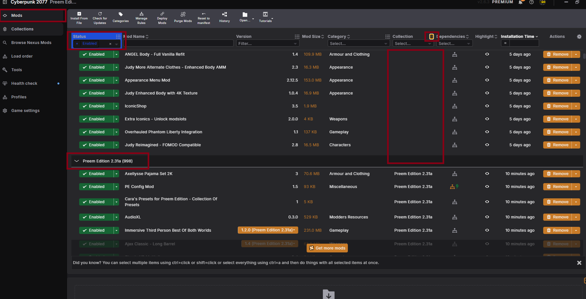{ width="500" }

- [ ] Identified which mods are personal vs. part of the collection

<input type="checkbox" class="pt-step-check" data-pt-step-check aria-label="Mark Step 3 complete">
Step 3: Highlighting personal mods

Now that you've identified your personal mods, use Vortex's highlight
system to clearly mark them. This makes it easy to find and re-enable
them once the collection update is done.

??? example "📷 Show me"
    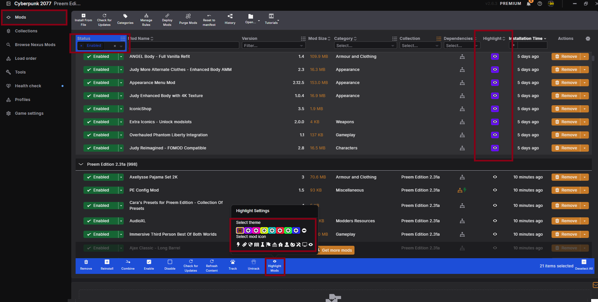{ width="500" }

- [ ] Highlighted all personal mods

<input type="checkbox" class="pt-step-check" data-pt-step-check aria-label="Mark Step 4 complete">
Step 4: Start the collection update

In Vortex, select the **Collections** tab. Under "Added Collections"
you'll find Preem Edition, if an update is available, a button will
appear at the top prompting you to update. Select it to start the update
process.

??? example "📷 Show me"
    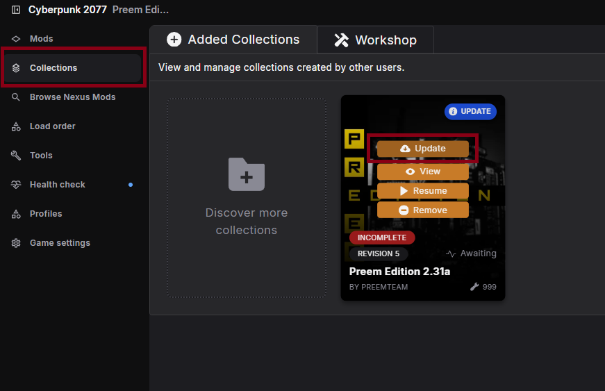{ width="500" }

- [ ] Started the collection update

<input type="checkbox" class="pt-step-check" data-pt-step-check aria-label="Mark Step 5 complete">
Step 5: Confirm the update

A popup will appear with a brief overview of the changes in this
revision, along with quick links to the website and Discord if you need
assistance.

??? example "📷 Show me"
    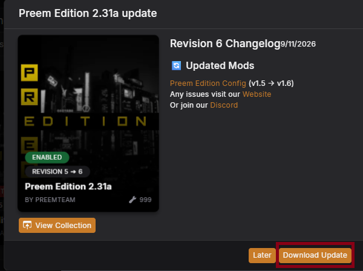{ width="500" }

- [ ] Reviewed the update overview

<input type="checkbox" class="pt-step-check" data-pt-step-check aria-label="Mark Step 6 complete">
Step 6: Remove mods from the old revision

The next popup asks what to do with mods from the old revision. **Always
select to remove all of them**, this clears out older versions, as well
as mods that have been removed from the collection entirely.

??? example "📷 Show me"
    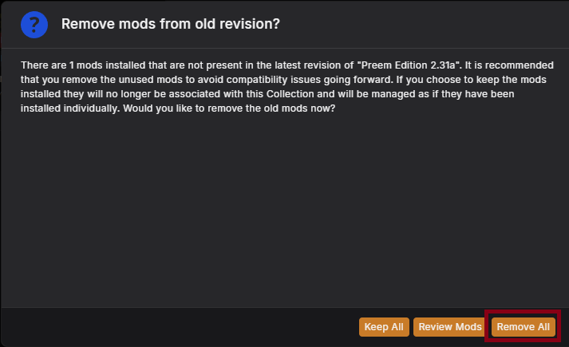{ width="500" }

!!! danger
    Choosing to keep old mods will cause issues, you'll end up with
    conflicting versions of mods enabled at the same time, which can
    cause crashes. If this happens, you'll need to perform a
    [Clean Install](../guides/clean_install.md).

- [ ] Selected to remove all mods from the old revision

<input type="checkbox" class="pt-step-check" data-pt-step-check aria-label="Mark Step 7 complete">
Step 7: Select new profile

You'll be asked where to install the update. The option
**"Create new profile (Recommended by curator)"** should already be
selected, if not, select it, then click **Install now**.

??? example "📷 Show me"
    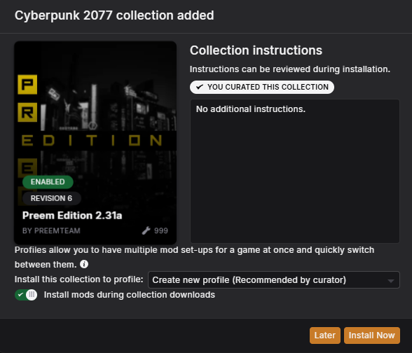{ width="500" }

!!! info
    Make sure **"Install mods during collection downloads"** is enabled
    to help speed up the update.

- [ ] Confirmed "Create new profile" and started the install

<input type="checkbox" class="pt-step-check" data-pt-step-check aria-label="Mark Step 8 complete">
Step 8: Final popup

One more quick popup will appear, just click **Yes**.

??? example "📷 Show me"
    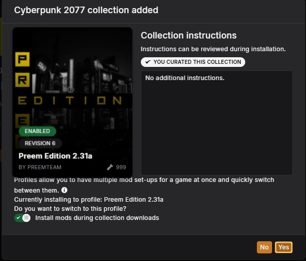{ width="500" }

- [ ] Confirmed the final popup

## Post-install checks

Once the update itself is done, run through these to make sure everything
came through clean.

  <input type="checkbox" class="pt-steps-progress-check" data-pt-progress-check disabled aria-hidden="true">
  

    0 / 4 steps complete
    

  

<input type="checkbox" class="pt-step-check" data-pt-step-check aria-label="Mark Clear Cache complete">
Post Install: Clear Cache

Once the collection has confirmed it's updated, head over to your
`Cyberpunk 2077\r6\cache` folder and delete its **contents**, don't
delete the folder itself, just what's inside it.

??? example "📷 Show me"
    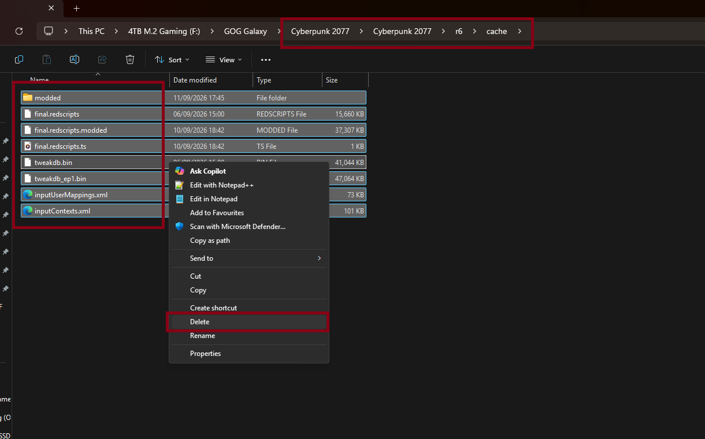{ width="500" }

- [ ] Cleared the contents of `r6\cache`

<input type="checkbox" class="pt-step-check" data-pt-step-check aria-label="Mark Verify Game Files complete">
Post Install: Verify Game Files

After updating the collection and clearing the cache, go back into
Steam/GOG/Epic Games (wherever the game is installed) and verify the
game files.

??? example "📷 Show me"
    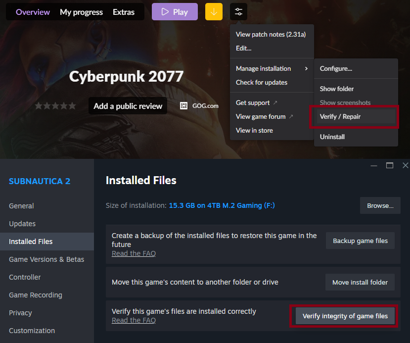{ width="500" }

- [ ] Verified game files through the platform launcher

<input type="checkbox" class="pt-step-check" data-pt-step-check aria-label="Mark Confirm game loads complete">
Post Install: Confirm game loads

Boot into the game. If you have no issues, well done, you've
successfully updated your Preem Edition. If you can't, or you're getting
crashes, see below.

!!! info "Getting Redscript compilation errors?"
    This is usually caused by lingering outdated mod versions still being
    active, often from forgetting to select "remove mods" in Step 6, or
    from installing something manually outside of Vortex. Fix it with a
    [Clean Install](../guides/clean_install.md).

!!! info "Getting flatline errors?"
    This is a common bug that can happen after altering game files. As
    strange as it sounds, most flatline errors are fixed by simply
    restarting your PC, a full Windows restart cycle seems to clear it.
    *("Have you tried turning it off and on again?", yes, really.)*

!!! info "Still having issues?"
    Reach out on the [Preem Team Discord](https://discord.gg/QvYzYZFmnE),
    or [create a GitHub Issue](https://github.com/mquiny/Preem-Team/issues/new/choose)
    so we can take a look.

- [ ] Confirmed the game boots correctly on the updated revision

<input type="checkbox" class="pt-step-check" data-pt-step-check aria-label="Mark Re-enable Personal Mods complete">
Post Install: Re-enable Personal Mods

We recommend confirming the step above, **before** re-enabling your
personal mods, that way you know the update itself was successful, so
if something breaks after adding your mods back, you know it's likely a
conflict with one of them rather than the update itself.

Back in the **Mods** tab, your highlighted personal mods will be listed
as "Disabled", simply re-enable them.

??? example "📷 Show me"
    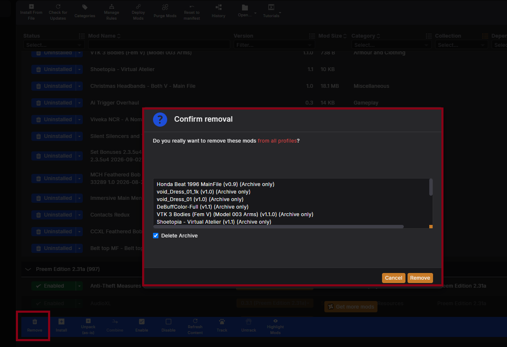{ width="500" }
    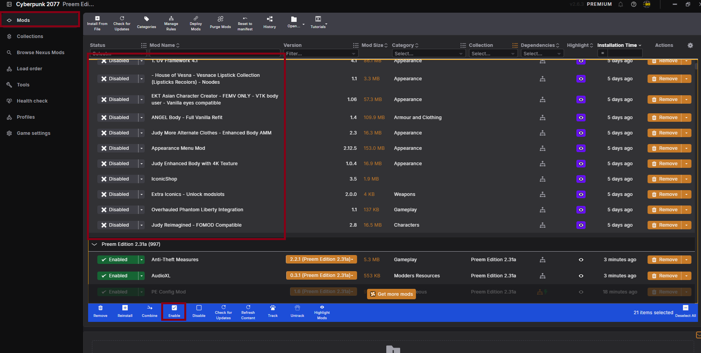{ width="500" }

!!! warning
    Mods listed as "Uninstalled" were removed during the update. You can
    decide whether to re-add them, but make sure whatever you bring back
    won't conflict with the recent update, otherwise, use "Delete
    Archive" to clean up your Vortex.

- [ ] Re-enabled personal mods and confirmed everything still works

!!! success "You're up to date"
    That's it, you're running the latest Preem Edition revision with
    your personal mods back in place.

