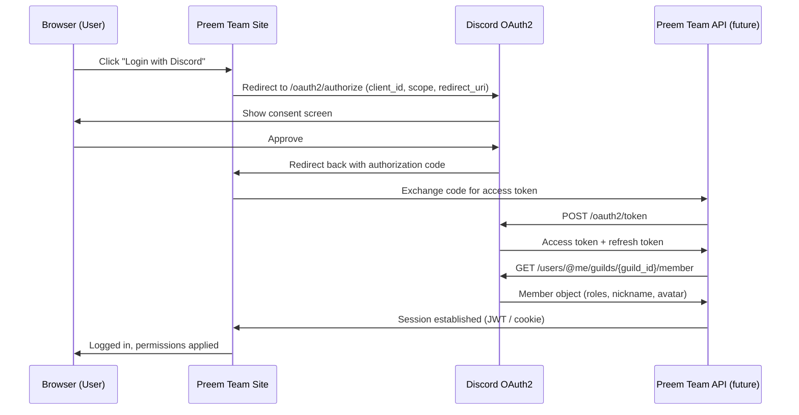
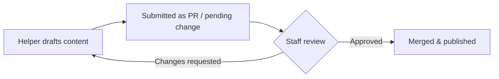

# DISCORD AUTHENTICATION // SYSTEM DESIGN CONCEPT

> `> THIS IS A CONCEPT DOCUMENT, NOT A SHIPPED FEATURE.`
> `> STATUS: DESIGN PHASE`

!!! danger "Not yet implemented"
    Nothing described on this page exists in the current version of the
    site. This is a design concept for a **future version** of Preem Team's
    documentation platform, written so staff and contributors can evaluate
    and refine the approach before any of it is built.

## Why authentication at all?

Right now, changes to Guides, FAQs, Troubleshooting entries, and the
Changelog require someone to edit Markdown files directly and push to the
repository. That works, but it means:

- Only people comfortable with Git/Markdown can contribute.
- There's no lightweight way to gate "who can edit what" beyond repo access.
- Staff have no way to authenticate the Discord bot's automated posts
  against a real identity/permission system.

A Discord-based login would let the site recognize **who** someone is (via
their existing Discord identity) and **what** they're allowed to do (via
their Discord server roles), without inventing a separate account system.

## High-level flow: Discord OAuth2 login



**In short:** the user logs in with Discord like they would for any other
app. Behind the scenes, the site asks Discord "which roles does this person
have in the Preem Team server?" and uses that to decide what they can do.

## Role-based permissions (concept)

| Discord Role | Site Permission Level | Can do |
|---|---|---|
| **Member** (default, everyone in the server) | Read-only | Browse all docs, no special site permissions — matches today's public experience. |
| **Helper** | Contributor | Submit/edit **Guides**, **FAQ** entries, and **Troubleshooting** entries via a proposed change (see workflow below). |
| **Staff / Collection Lead** | Full editor | Everything Helpers can do, plus publish directly without review, edit the **Changelog**, and manage the **Issue Viewer** sync. |

!!! note "Members get nothing extra — on purpose"
    For this initial concept, regular **Members** retain exactly the
    permissions they have today: full read access to the entire site, no
    write access. This keeps the blast radius of a first implementation
    small. Expanding Member permissions (e.g. commenting, showcase
    submissions) is a possible **future** iteration, not part of this
    concept.

## Proposed contribution workflow (Helpers)

Rather than giving Helpers direct write access to the live site, the
recommended flow keeps a review step in place:

1. Helper logs in via Discord OAuth2.
2. Site verifies their `Helper` role via the Discord API.
3. Helper uses a lightweight in-site editor (or a linked GitHub-based flow)
   to draft a new Guide, FAQ entry, or Troubleshooting fix.
4. Submission is opened as a **pull request** (if backed by Git) or a
   **pending change** in a moderation queue (if backed by a database).
5. A Staff-level user reviews and approves/merges the change.
6. Site rebuilds and the change goes live.



This mirrors how the current Git-based workflow already works, just with a
friendlier front-end for non-technical Helpers instead of requiring direct
repository access.

## Recommended API endpoints (concept only)

These are illustrative endpoint shapes for a future backend service — not
an implemented API.

```text
GET  /auth/discord/login
     Redirects the user to Discord's OAuth2 consent screen.

GET  /auth/discord/callback
     Handles the OAuth2 redirect, exchanges the code for tokens,
     fetches guild member info, and establishes a site session.

POST /auth/logout
     Clears the local session.

GET  /api/me
     Returns the logged-in user's Discord identity + resolved
     site permission level (Member / Helper / Staff).

POST /api/contributions/guides
     (Helper+) Submit a new or edited guide as a pending change.

POST /api/contributions/faq
     (Helper+) Submit a new or edited FAQ entry as a pending change.

POST /api/contributions/troubleshooting
     (Helper+) Submit a new or edited troubleshooting entry as a
     pending change.

GET  /api/contributions/pending
     (Staff only) List all pending contributions awaiting review.

POST /api/contributions/{id}/approve
     (Staff only) Approve and publish a pending contribution.

POST /api/contributions/{id}/reject
     (Staff only) Reject a pending contribution, optionally with
     feedback returned to the submitter.

POST /api/changelog/publish
     (Staff / bot only) Publish a new changelog entry using the
     format defined in changelog/template.md, and archive the
     previous "latest" entry.
```

## Security considerations (concept)

!!! warning "Things to get right before building this"
    - **Never trust client-supplied role claims.** Roles must always be
      re-verified server-side against the live Discord API (or a short-lived
      cache of it) on every privileged action — not just at login.
    - **Scope the OAuth2 request minimally.** Only request `identify` and
      `guilds.members.read` scopes — no more than needed to resolve roles.
    - **Short-lived sessions, refreshable tokens.** Avoid long-lived access
      tokens stored client-side; use short session JWTs backed by a
      server-side refresh flow.
    - **Rate-limit contribution endpoints** to prevent spam submissions from
      compromised or bad-faith Helper accounts.
    - **Audit log everything.** Every publish, approve, and reject action
      should be logged with the acting user's identity for accountability.

## Open questions for future design passes

- Should Helper status be tied to a live Discord role check on every page
  load, or cached and synced periodically (e.g. hourly)?
- Should the review queue live inside this MkDocs site, or in a separate
  lightweight admin dashboard?
- Should Staff be able to publish Changelog entries manually through this
  system, or should that remain bot-only (per
  [`changelog/template.md`](../changelog/template.md))?

These questions are intentionally left open — this document exists to
frame the problem and propose a plausible shape, not to lock in a final
implementation.

<div class="pt-flavor">
"Trust no client. Verify every role. That's just good netrunning hygiene." — Systems design notes
</div>
