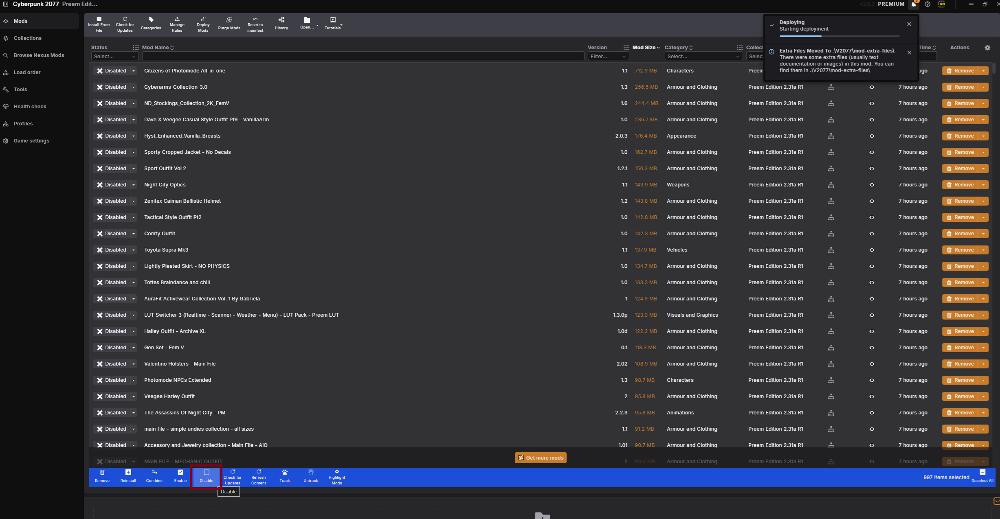
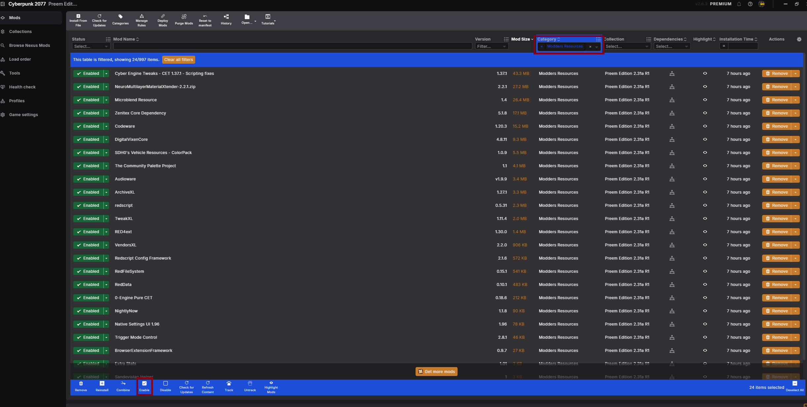
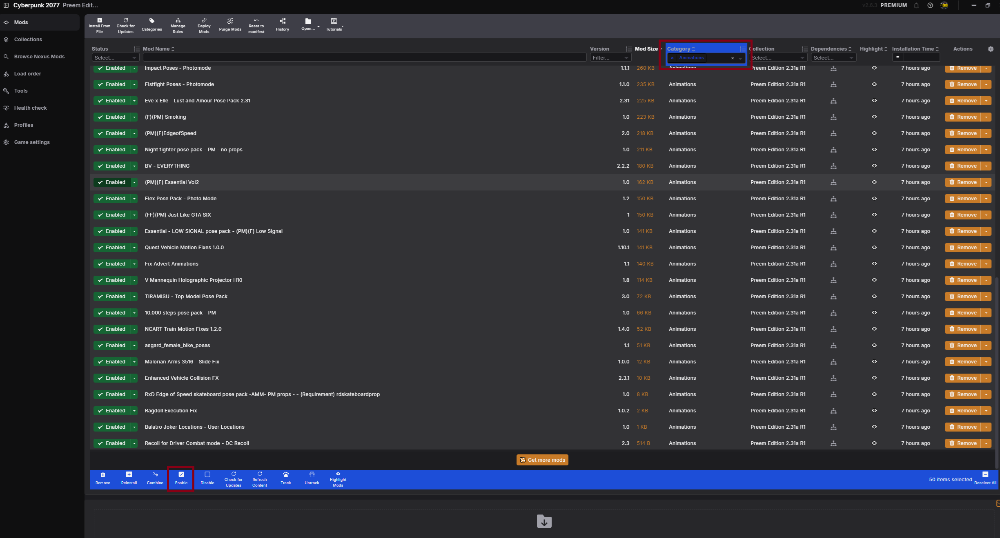
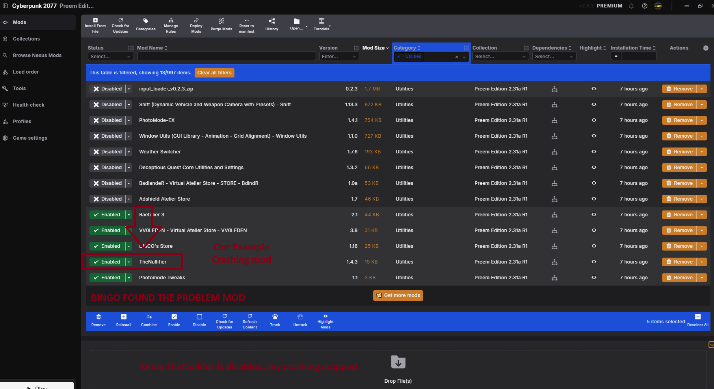

# HOW TO BISECT // ISOLATING THE FAULT

> `> RUNNING BINARY SEARCH...`
> `> TARGET: THE ONE MOD RUINING YOUR NIGHT`

In short, bisecting is a method to identify mods in the collection that could
be causing issues, crashes, or glitches. The basic premise is to chunk-enable
mods bit by bit until you either reproduce the issue, or rule enough mods out
that only one suspect is left.

!!! warning "Check this before starting"
    Before getting started, double check you have the correct V2077 settings
    inside of Vortex.

    Check the V2077 settings so **"Don't prompt when reaching fallback installer"** is **ON**.

    If your settings match the image below, you're good to proceed with
    bisecting your collection.

    ??? example "📷 Show me"
        { width="500" }

## Overview checklist

Use this as your master checklist. Each item is explained in detail below.

- [ ] Verified my V2077 settings match what's required
- [ ] (Optional) Performed a Clean Install
- [ ] Disabled all mods
- [ ] Enabled core mods (Modders Resources) and confirmed they aren't the issue
- [ ] Enabled categories one at a time until the issue reappeared
- [ ] Chunk-enabled mods within the guilty category to find the exact mod

## Step-by-step bisecting

Tick a step off once you've finished it — your progress is saved in this
browser, so it's still here if you close the tab and come back later.

  <input type="checkbox" class="pt-steps-progress-check" data-pt-progress-check disabled aria-hidden="true">
  

    0 / 5 steps complete
    

  

<input type="checkbox" class="pt-step-check" data-pt-step-check aria-label="Mark Step 0 complete">
Step 0 (Optional): Clean Install

This step isn't super important, but it can rule out the game itself as an
issue. Following the [Clean Install](../guides/clean_install.md) guide to
remove all mod traces can help identify whether the game is to blame, or the
collection (a mod inside the collection).

- [ ] I performed a clean install, or decided to skip this step

!!! tip
    If you're confident the issue is mod-related (or you don't want to
    reinstall), skip straight to Step 1.

<input type="checkbox" class="pt-step-check" data-pt-step-check aria-label="Mark Step 1 complete">
Step 1: Disable all mods

If you don't want to clean install, first what you want to do is disable all
the mods.

1. In Vortex, under **Mods**, select them all (`Ctrl+A`).
2. At the bottom bar, select **Disable**.

This will start your bisect process with nothing enabled. Now move onto Step 2.

- [ ] All mods are disabled

??? example "📷 Show me"
    { width="500" }

<input type="checkbox" class="pt-step-check" data-pt-step-check aria-label="Mark Step 2 complete">
Step 2: Enable core mods

Now that you've either done a [Clean Install](../guides/clean_install.md) or
disabled all mods in Vortex, in the **Mods** tab, under the **Categories**
section, click the dropdown and select **Modders Resources**, then enable
them all.

This is required for a successful bisect, as most of the mods depend on these
being present in order to function. Enabling them first ensures the core
framework mods work as intended, and rules them out as the culprit.

- If you enable these mods and still crash, then likely a core mod isn't
  installed properly.
- If these are enabled and the game boots fine, great — it's not a core mod
  causing the issue.

- [ ] Core mods (Modders Resources) enabled and game boots fine

??? example "📷 Show me"
    { width="500" }

<input type="checkbox" class="pt-step-check" data-pt-step-check aria-label="Mark Step 3 complete">
Step 3: Enabling categories

Now you've confirmed the core mods aren't the problem, it's time to go
category by category and enable them one at a time until you can replicate
the crash/issue.

1. Start with **Animations** — enable all the mods in that category, boot the
   game, and double check the issue isn't there.
2. If it's not crashing, you know it's not an animation mod. Close the game
   and move onto the next category.
3. Repeat for each category until you run into the crash/issue — then you'll
   know the rough area the problem lies in.

*Example: you begin to crash/experience your issue after enabling the
**Utilities** category — bingo, you now have your chunk of potential mods.*

!!! danger "Ignore the Cyberpunk 2077 category"
    Every mod is listed under this category, so enabling it will guarantee
    you crash and get you nowhere. **Do not** enable this category.

- [ ] Found the category that reproduces the issue

??? example "📷 Show me"
    { width="500" }

<input type="checkbox" class="pt-step-check" data-pt-step-check aria-label="Mark Step 4 complete">
Step 4: Identified the category

Now that you've narrowed down which category the problem is in, it's time to
chunk-enable all the mods in that category until you replicate your
crash/issue. *(For the example above, the issue was in **Utilities**.)*

1. Filter by that category, enable one half of the mods inside it, and leave
   the other half disabled.
2. Boot the game and see if the crash/issue is present.
      - If it's **not**, that half is fine — go ahead and enable half of the
        remaining disabled mods too (now 3/4 of the category is enabled).
        Boot the game and repeat as required until you narrow in on the mod.
      - If it **does** crash, you're close — do the reverse: disable half of
        the mods you just enabled, and repeat until you're left with the one
        mod causing your crash.

!!! example "Worked example"
    Say the problem mod is **The Nullifier**, and it's enabled — you
    crash when loading the game.

    You disable one half of the enabled mods (say, "input_loader_v0.2.3" through
    "Adshield Atelier Store"), leaving the other half enabled. The Nullifier is
    still enabled, so you still crash — you're getting close. Down to 5
    mods, you check one by one until you stop crashing, and there it is:
    disabling **The Nullifier** stops the crash.

    **Bingo — found the problem mod.**

Once you've identified the mod responsible, confirm the fix: re-enable every
mod **except** the one you bisected. If you don't crash/have the issue
anymore, you've successfully bisected your collection.

If you still crash, multiple mods might be causing issues, and you'll need to
keep bisecting to find the rest.

- [ ] Identified the single mod causing the issue
- [ ] Confirmed the fix by re-enabling everything except that mod

??? example "📷 Show me"
    { width="500" }

!!! success "Bisected!"
    That's it — you've found your problem mod. Report it in the **Preem Team
    Discord** so staff can look into a fix or flag a known conflict.

!!! failure "Still crashing after bisecting?"
    Something more unusual is going on. Head to
    [Troubleshooting](index.md) or
    [Common Problems](common_problems.md), or file a proper
    [bug report](index.md#still-stuck-file-an-issue).

"Every collection hides one mod that doesn't want to be found. Bisecting is how you drag it into the light." — Preem Team support notes

