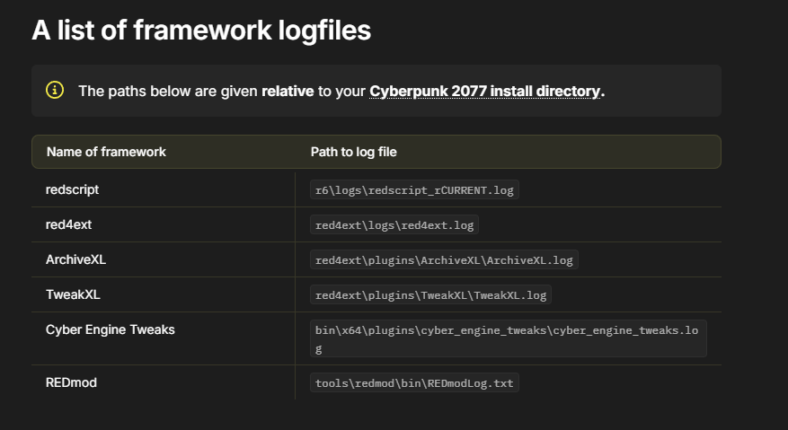

# TROUBLESHOOTING // DIAGNOSTIC MODE

> `> RUNNING DIAGNOSTICS...`
> `> SCANNING FOR KNOWN FAULTS...`

Something broke? Start here before pinging staff in Discord — most issues
have already been solved once.

## Troubleshoot/Diagnostics

-   :material-format-list-bulleted:{ .lg .middle } **[Common Problems](common_problems.md)**

    ---

    Known issues and their fixes, maintained by staff.

-   :material-magnify-scan:{ .lg .middle } **[How to Bisect](how_to_bisect.md)**

    ---

    Step-by-step guide to isolating exactly which mod is causing your crash
    or issue.

-   :material-chat-question:{ .lg .middle } **[Quick Commands](quick_commands.md)**

    ---

    Every shortcut phrase Choomba Bot auto-replies to in Discord, all in
    one searchable list.

## GitHub Issues Tracker 

-   :material-radar:{ .lg .middle } **[Issue Viewer](issue_viewer.md)**

    ---

    Live-synced view of open GitHub issues for the collection.
	
-   :material-archive-search:{ .lg .middle } **[Issue Archive](issue_archive.md)**

    ---

    Live-synced view of closed GitHub issues — see what's already fixed.
	

## Before you report anything

1. Check [Common Problems](common_problems.md) and [Issue Archive](issue_archive.md) — your issue is probably already documented.
2. Check the [Changelog](../changelog/index.md) for any outfit/weapon mods that might have been remove that you used. That can cause crashes when loading saves.
3. Check the [FAQ](../faq/index.md) for quick answers to common questions.
4. Confirm you followed every step in [Installation](../installation/index.md), especially the verification checklist.

!!! warning "Don't skip the logs"
    Have a little browse through some of the logs, it might give you an indication as to what's crashing. Although this is rare, so we recommend a [Clean Install](../guides/clean_install.md) or a [How To Bisect](how_to_bisect.md)
    
	??? example "📷 Show me"
        { width="500" }
			
## Still stuck? File an issue

If you've checked the above and you're still stuck, or you've found a bug
that isn't documented, file a proper issue on GitHub.

<a href="https://github.com/mquiny/Preem-Team/issues/new/choose" class="md-button md-button--primary" target="_blank" rel="noopener">
:material-github: Create New Issue
</a>

!!! tip "Writing a good bug report"
    A fast fix starts with a clear report. Include:

    - [ ] Your Cyberpunk 2077 version and Preem Team collection version
    - [ ] What Platform are you running the game from (Steam/GOG/Epic Games)
    - [ ] Exact steps to reproduce the issue (Screenshots/Videos?)
    - [ ] Have you added any additional mods on top of the collection (This can also be an issue if they conflict with mods inside of the collection)
    - [ ] Whether the issue happens on a fresh save or an existing one
	- [ ] What are your hardware specs? (Mainly your CPU/GPU/RAM) 

Issues filed without this information take longer to triage — staff will
usually ask for it anyway, so including it up front speeds things up
considerably.

"Every crash log tells a story. Most of them are tragedies. A few are mysteries." — Support team

